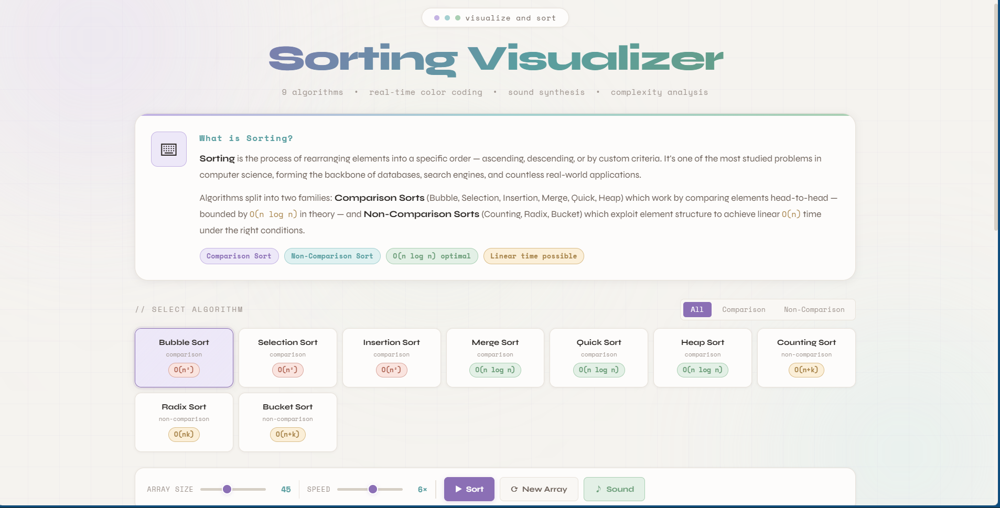

# Sorting Visualizer

An interactive algorithm visualization tool built with HTML, CSS and vanilla JavaScript featuring real-time animated sorting, complexity analysis, sound synthesis and comparison vs non-comparison sorting demonstrations.

## Tech Stack

HTML5 • CSS3 • JavaScript • Web Audio API • Algorithms Visualization

---

## Overview

Sorting Visualizer transforms classic algorithms into an interactive educational playground where users can observe how sorting works step-by-step.

Designed as a data structures and algorithms project, it demonstrates algorithm animation, asynchronous JavaScript execution, complexity analysis and interactive visualization design.

---

## Interface Preview

### Main Dashboard



### Algorithm Animation


### Complexity Reference Panel


---

## Preview

| Feature       | Description                                |
| ------------- | ------------------------------------------ |
| Algorithms    | 9 sorting algorithms implemented           |
| Visualization | Real-time animated sorting bars            |
| Audio         | Optional sound synthesis during operations |
| Analysis      | Live complexity stats and metrics          |
| Responsive    | Desktop and mobile compatible              |

---

## Getting Started

No installation required.

```text id="sv1"
sorting-visualizer/
├── index.html
├── style.css
├── script.js
├── Sorting.png
├── Sorting Algo.png
└── Complexity Ref.png
```

Open directly in any modern browser:

```bash id="sv2"
open index.html
```

---

## Implemented Algorithms

### Comparison Sorting

| Algorithm      | Average Time |
| -------------- | ------------ |
| Bubble Sort    | O(n²)        |
| Selection Sort | O(n²)        |
| Insertion Sort | O(n²)        |
| Merge Sort     | O(n log n)   |
| Quick Sort     | O(n log n)   |
| Heap Sort      | O(n log n)   |

---

### Non-Comparison Sorting

| Algorithm     | Average Time |
| ------------- | ------------ |
| Counting Sort | O(n+k)       |
| Radix Sort    | O(nk)        |
| Bucket Sort   | O(n+k)       |

---

## Features

### Real-Time Visualization

* Animated bar comparisons
* Swap highlighting
* Pivot/key highlighting
* Sorted-state visualization
* Adjustable array sizes
* Adjustable sorting speed

---

## Live Metrics Dashboard

Tracks during runtime:

* Total comparisons
* Swaps / operations
* Execution time
* Current array size

---

## Sound Synthesis

Optional sound feedback generated through Web Audio API for sorting operations.

Can be toggled on/off.

---

## Educational Theory Section

Includes:

* What is Sorting overview
* Comparison vs Non-Comparison sorting explanation
* One-line definitions for all algorithms
* Built-in complexity reference cards

---

## File Overview

### `index.html`

Contains:

* Visualization layout
* Control panel
* Theory section
* Complexity reference cards

---

### `style.css`

Handles:

* Cyber-glass visual styling
* Animated grid background
* Algorithm cards
* Bar states and transitions
* Responsive layout

---

### `script.js`

Core algorithm engine written in vanilla JavaScript.

| Function          | Purpose                       |
| ----------------- | ----------------------------- |
| `generateArray()` | Creates randomized array      |
| `renderBars()`    | Draws visualization bars      |
| `bubbleSort()`    | Bubble sort animation         |
| `selectionSort()` | Selection sort animation      |
| `mergeSort()`     | Recursive merge visualization |
| `quickSort()`     | Pivot partition animation     |
| `updateStats()`   | Updates live metrics          |
| `playTone()`      | Generates sound feedback      |

---

## Color Legend

| Color   | Meaning                  |
| ------- | ------------------------ |
| Default | Unprocessed elements     |
| Purple  | Elements being compared  |
| Red     | Elements being swapped   |
| Amber   | Pivot or key element     |
| Cyan    | Bucket / auxiliary state |
| Green   | Sorted elements          |

---

## Concepts Demonstrated

* Data structures and algorithms
* Algorithm visualization
* Async JavaScript timing
* DOM animation logic
* Complexity analysis
* Web Audio API integration

---

## Browser Support

| Browser     | Support   |
| ----------- | --------- |
| Chrome 90+  | Supported |
| Firefox 88+ | Supported |
| Safari 14+  | Supported |
| Edge 90+    | Supported |

---

## Future Improvements

Potential upgrades:

* Graph complexity plotting
* Side-by-side algorithm race mode
* Custom array input
* Searching algorithm visualizations
* More advanced sorts (Shell, TimSort)

---

## License

Free to use and modify for personal or commercial projects.

Built with HTML, CSS and vanilla JavaScript.
No frameworks. No build tools. Just open and explore.
