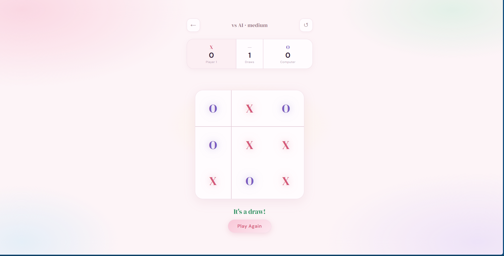

# Tic Tac Toe

A sleek browser-based Tic Tac Toe game built with vanilla JavaScript, featuring game-state logic, winner detection, draw handling, and responsive gameplay — no frameworks, no dependencies, just three files.

## Tech Stack

HTML5 • CSS3 • JavaScript • Game Logic • DOM Manipulation

---

## Overview

This project recreates the classic Tic Tac Toe game with a modern interface and dynamic gameplay logic.

Designed as a frontend logic project, it demonstrates turn-based state management, condition evaluation, event handling, and interactive UI behavior.

---

## Interface Preview

### Home Screen


### Winning State


### Draw State



---

## Preview

| Feature    | Description                                   |
| ---------- | --------------------------------------------- |
| Theme      | Minimal dark interface with neon-accent board |
| Gameplay   | Two-player turn-based logic                   |
| Logic      | Win and draw detection                        |
| Responsive | Desktop and mobile compatible                 |

---

## Getting Started

No installation required.

```text id="tt1"
tic-tac-toe/
├── index.html
├── style.css
├── script.js
├── Home Page.png
├── Computer Wins.png
└── Draw.png
```

Open directly in any modern browser:

```bash id="tt2"
open index.html
```

---

## Features

### Gameplay

* Two-player local game (X and O)
* Alternate turn handling
* Click any empty square to place moves
* Automatic winner detection
* Draw detection
* Instant replay via restart button

---

## Smart Game Logic

| Logic          | Description                        |
| -------------- | ---------------------------------- |
| Win Detection  | Checks rows, columns and diagonals |
| Turn Switching | Alternates players automatically   |
| Draw Check     | Detects stalemate conditions       |
| Reset          | Clears board and starts fresh      |

---

## UI Features

* Interactive hover effects
* Dynamic turn indicator
* Winning state announcement
* Responsive game board layout
* Smooth button and cell transitions

---

## File Overview

### `index.html`

Semantic structure containing:

* Game board
* Turn status display
* Restart controls

---

### `style.css`

Responsible for:

* 3×3 board layout using CSS Grid
* Hover interactions
* Winning state styling
* Responsive mobile layout

---

### `script.js`

Core game engine written in vanilla JavaScript.

| Function         | Purpose                        |
| ---------------- | ------------------------------ |
| `handleClick(i)` | Places move in selected square |
| `checkWinner()`  | Evaluates winning combinations |
| `switchTurn()`   | Alternates turns               |
| `resetGame()`    | Resets board state             |
| `updateStatus()` | Updates turn/winner display    |

---

## Game State

Board state is represented as:

```json id="tt3"
[
"X",
null,
"O",
null,
"X",
null,
null,
"O",
null
]
```

Each move updates state and re-runs winner checks.

---

## Winning Combinations

```javascript id="tt4"
[
[0,1,2],
[3,4,5],
[6,7,8],
[0,3,6],
[1,4,7],
[2,5,8],
[0,4,8],
[2,4,6]
]
```

---

## Concepts Demonstrated

* Game-state management
* Conditional logic
* DOM event handling
* Array-based win evaluation
* Interactive UI design

---

## Browser Support

| Browser     | Support   |
| ----------- | --------- |
| Chrome 90+  | Supported |
| Firefox 88+ | Supported |
| Safari 14+  | Supported |
| Edge 90+    | Supported |

---

## Customization

### Change Board Accent Color

```css id="tt5"
:root{
--accent:#00e5ff;
}
```

---

### Change X and O Colors

```css id="tt6"
.x{
color:#00e5ff;
}

.o{
color:#ff6b6b;
}
```

---

## Future Improvements

Potential upgrades:

* Minimax AI opponent
* Difficulty levels
* Scoreboard tracking
* Multiplayer over WebSockets

---

## License

Free to use and modify for personal or commercial projects.

Built with HTML, CSS and vanilla JavaScript.
No frameworks. No build tools. Just open and play.
