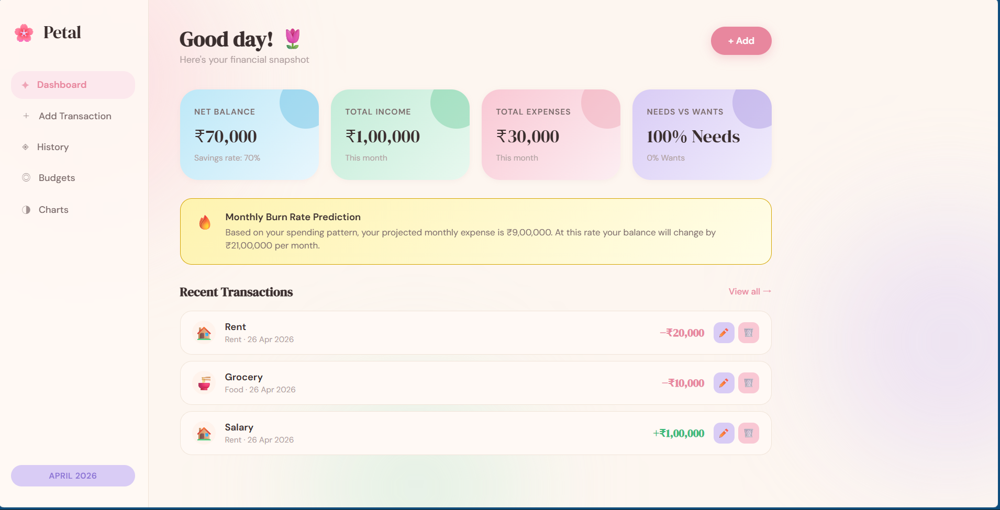
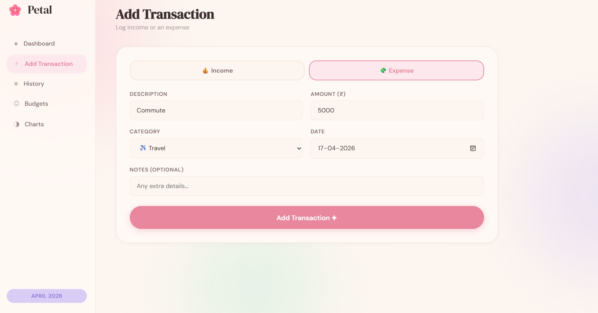
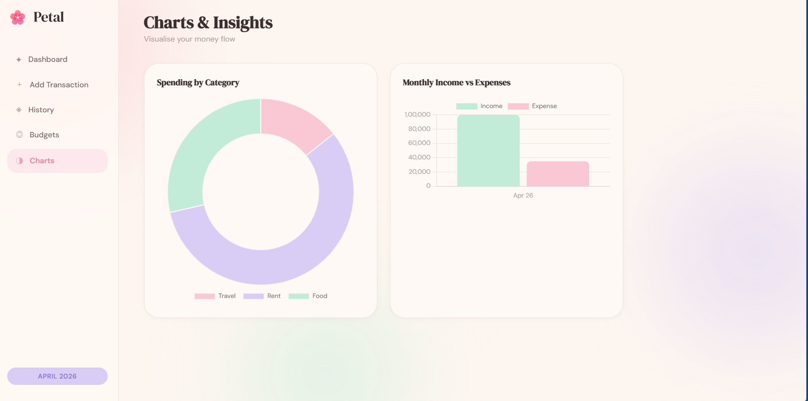
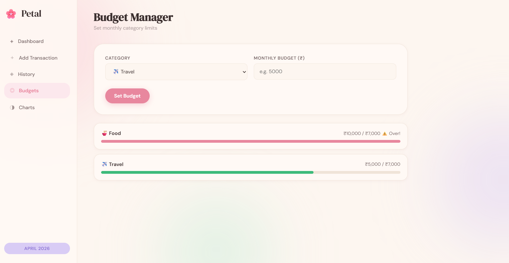

# Petal — Personal Expense Tracker

A sleek pastel-themed personal finance dashboard built with pure HTML, CSS and JavaScript, featuring budgeting, charts, predictive insights and full localStorage persistence — no frameworks, no build tools, just three files.


## Preview

Add screenshots here:







| Feature | Description |
|---|---|
| Theme | Soft pastel finance dashboard with animated blobs |
| Storage | Browser localStorage persistence |
| Analytics | Charts, burn-rate prediction, budget alerts |
| Responsive | Desktop + mobile friendly |


## Getting Started

No installation required. Just download and open.

```text
Personal-Expense-Tracker/
├── index.html
├── style.css
└── script.js
```

1. Download all three files into the same folder  
2. Open `index.html` in any modern browser  
3. Start tracking income and expenses  


## Features

## Financial Dashboard
- Live net balance tracking  
- Income vs expense cards  
- Savings rate percentage  
- Needs vs wants analysis score  
- Recent transaction summary  

## Transaction Management
- Add income and expenses  
- Edit existing transactions  
- Delete transactions  
- Search and category filters  
- Notes + date logging  

## Budgeting & Insights

| Tool | Purpose |
|---|---|
| Category Budgets | Set monthly spending limits |
| Budget Alerts | Warn when limits are exceeded |
| Burn Rate Prediction | Estimates monthly spend trend |
| Spending Insight Engine | Detects category spikes or drops |

## Visual Analytics
- Category spending pie chart  
- Monthly income vs expense bar chart  
- Trend analysis cards  
- Color-coded financial signals  


## File Overview

## `index.html`
Application structure and dashboard sections.

Includes:
- Sidebar navigation  
- Transaction forms  
- Budget manager  
- Chart containers  
- Edit modal system  

## `style.css`
Pastel design system using CSS variables.

Highlights:
- Animated floating background blobs  
- Glassmorphism-inspired cards  
- Pastel finance color palette  
- Responsive mobile layouts  
- Micro-interactions and transitions  

## `script.js`

Vanilla JavaScript logic powering the app.

| Function | Purpose |
|---|---|
| `addTransaction()` | Adds new entries |
| `renderDashboard()` | Updates financial summary |
| `renderBudgets()` | Calculates budget usage |
| `renderCharts()` | Builds analytics charts |
| `renderBurnRate()` | Projects spending trend |
| `renderTrendInsight()` | Generates spending insights |
| `save()` | Persists data to localStorage |


## Local Storage

Data is saved under:

```javascript
petal-txns
petal-budgets
```

Sample transaction object:

```json
{
"id":1713870000000,
"desc":"Groceries",
"amount":2400,
"type":"expense",
"category":"Food",
"date":"2026-04-26"
}
```


## Tech Stack

- HTML5  
- CSS3  
- Vanilla JavaScript  
- Chart.js  
- localStorage API  


## Browser Support

| Browser | Support |
|---|---|
| Chrome 90+ | Yes |
| Firefox 88+ | Yes |
| Safari 14+ | Yes |
| Edge 90+ | Yes |


## Roadmap

Planned upgrades:

- Dark mode  
- Recurring expenses  
- CSV export  
- PDF reports  
- Savings goals  
- Backend authentication  
- PostgreSQL / MongoDB integration  


## Customization

Change pastel theme colors:

```css
:root{
--pink:#f9c8d4;
--mint:#c3ecd8;
--lavender:#d9ccf5;
}
```

Swap fonts in:

```html
index.html
```


## License

Free to use and modify for personal and commercial projects.

Built with HTML, CSS and vanilla JavaScript.  
No frameworks. No build tools. Just open and use.
